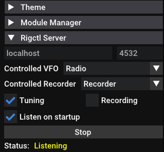

#Cat-relay
## About
Cat-relay is a Ham/SWL utility, written in Python3. It synchronizes frequency between SDR++ and RUMlogNG logging software, 
so SDR++ can act as a band scope/panadapter for your radio.

## Supported platforms and software
Although Cat-relay is platform independent, the main use case is running SDR++ with RUMlogNG on MacOS. 
It may work with other SDR software that are compatible with Hamlib/Rigctl, or other logging software that uses Dxlab Commander 
commands. At this moment, no software other than SDR++ and RUMlogNG is tested, including Dxlab Commander. 

##  How is works
Cat-relay reads frequencies and modes from SDR++ and RUMlogNG every 50ms (configurable), and synchronizes them if either of them changes.

## Mode mapping
Most common modes are supported in both SDR++ and RUMlogNG therefore should work properly, e.g., CW, USB, LSB, AM and FM. 
Some modes are only supported in one or the other. For example, my radio (TS-590SG) reports RTTY mode, which SDR++ 
doesn't support. Following mapping and limitation is implemented. It suits my needs. I believe it will also be acceptable 
for other users.

- RTTY mode (from radio) will be mapped to USB mode
- WFM mode (from SDR++) will be mapped to FM mode
- RAW mode (from SDR++) will not be supported
- DSB mode (from SDR++) will not be supported

## Prerequisites
- CAT control needs to be correctly configured in RUMlogNG
- "DxLab Suite Commander" needs to be set to "Start" in RUMLogNG
- "Rigctl Server" needs to be configured to run in SDR++
- Correct IP addresses for RUMlogNG and SDR++ need to be set in config.yml unless you run everything on the same computer
- Correct ports need to be set in config.yml, unless you happened to have the same ports as mine

Example RUMlogNG settings 


Example SDR++ settings

 

## Dependencies
Cat-relay uses only one 3rd party library (pyyaml). To install it, open a terminal, go to the folder that contains cat-relay, 
and run following command:

```pip3 install -r requirements.txt```

## How to run
Open a terminal, go to the folder that contains cat-relay, and run following command:

```python3 listen.py```

Don't close the terminal window, you can minimize it if you'd like to.

## How to quit
Open the terminal window that cat-relay is running in and press Ctrl+C.