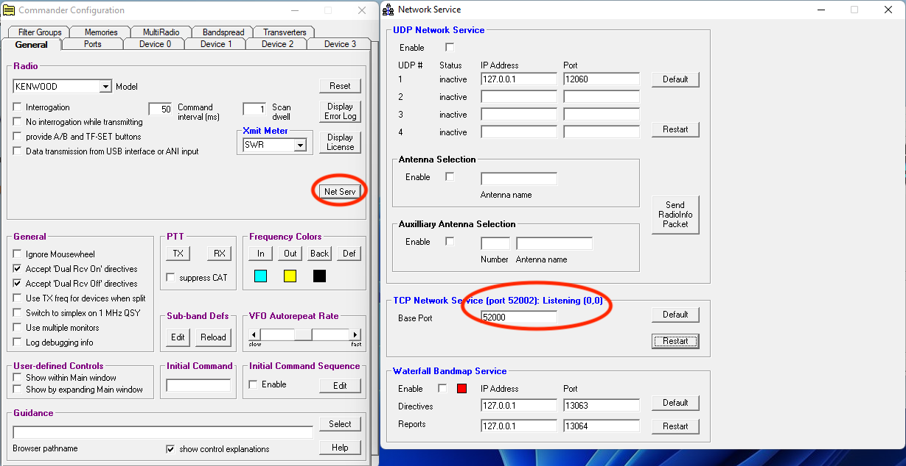
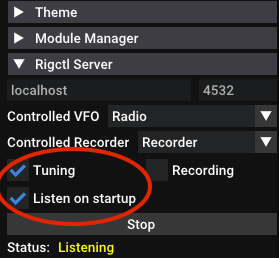

#Cat-relay
## About
Cat-relay is a tool to change your SDR into a band scope/panadapter for your radio. It synchronizes frequencies and modes
between SDR software and logging software. 

##  How is works
Cat-relay reads frequencies and modes from SDR and logging software every 50ms (configurable), and synchronizes them if either
of them changes. Cat-relay, SDR and logging software can run on the same computer or different computers in the same local
network.

## Supported platforms and software
Cat-relay was written in Python3 and can run on Mac, Windows and Linux. However, the main use case is running SDR++ 
(cross-platform) with RUMlogNG on MacOS or DXLab Commander on Windows. 

It may work with other SDR software if it provides a Hamlib/Rigctl compatible TCP server, or other logging software if it
provides a DXLab Commander compatible TCP server. At this moment, only SDR++, RUMlogNG and DXLab Commander are tested. 
MacLoggerDX will also work, except changing modes on SDR is not supported by MacLoggerDX. 

## Mode mapping
Most common modes are supported in both SDR++ and RUMlogNG/DXLab Commander therefore should work properly, e.g., CW, USB, LSB, AM and FM. 
Some modes are only supported in one or the other. For example, my radio (TS-590SG) reports RTTY mode, which SDR++ 
doesn't support. Following mapping and limitation is implemented. It suits my needs. I believe it will also be acceptable 
for other users.

- RTTY mode (from radio) will be mapped to USB mode
- WFM mode (from SDR++) will be mapped to FM mode
- RAW mode (from SDR++) will not be supported
- DSB mode (from SDR++) will not be supported

## Prerequisites
- CAT control needs to be correctly configured in RUMlogNG/DXLab Commander
- "DxLab Suite Commander" needs to be set to "Start" in RUMLogNG. If you are using DXLab Commander, it's enabled by 
  default. You can change port (52002) by clicking "Net Serv" button in "General" tab.
- "Rigctl Server" needs to be configured to run in SDR++
- Correct IP addresses for RUMlogNG/DXLab Commander and SDR++ need to be set in config.yml unless you run everything on 
  the same computer
- Correct ports need to be set in config.yml, unless you happened to have the same ports as mine

Example RUMlogNG settings 


Example DXLab Commander settings 



Example SDR++ settings

 

## Dependencies
Cat-relay uses only one 3rd party library (pyyaml). To install it, open a terminal, go to the folder that contains cat-relay, 
and run following command:

```pip3 install -r requirements.txt```

## How to run
Open a terminal, go to the folder that contains cat-relay, and run following command:

```python3 listen.py```

Don't close the terminal window, you can minimize it if you'd like to.

## How to quit
Open the terminal window that cat-relay is running in and press Ctrl+C.